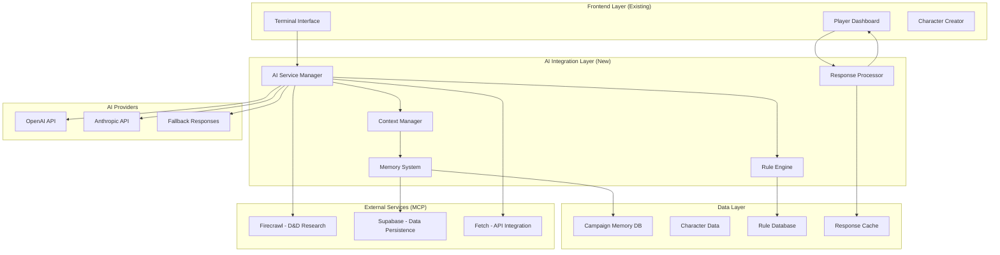

# Design Document

## Overview

The AI DM Integration system transforms our existing terminal-based D&D interface from a prototype with mock responses into a fully intelligent Dungeon Master powered by real AI services. The design leverages the existing terminal interface, dashboard, and character management systems while adding a sophisticated AI layer that can generate dynamic narratives, enforce D&D 5e rules, and maintain campaign continuity across sessions.

The core architecture introduces an AI Service Abstraction Layer that supports multiple providers (OpenAI, Anthropic), implements intelligent caching and memory management, and provides seamless integration with the existing game systems. This design ensures high performance, reliability, and scalability while maintaining the immersive terminal-based RPG experience.

## Architecture

### High-Level Architecture



### AI Service Architecture

#### AI Service Manager
The central orchestrator that handles all AI interactions, provider selection, and failover logic.

```typescript
interface AIServiceManager {
  // Core AI operations
  generateResponse(context: GameContext, input: string): Promise<AIResponse>;
  selectProvider(requestType: RequestType): AIProvider;
  handleFailover(failedProvider: AIProvider): Promise<AIProvider>;
  
  // Performance optimization
  cacheResponse(key: string, response: AIResponse): void;
  getCachedResponse(key: string): AIResponse | null;
  
  // Monitoring and health
  getProviderHealth(): ProviderHealthStatus[];
  trackUsageMetrics(provider: AIProvider, usage: UsageMetrics): void;
}

interface AIProvider {
  name: 'openai' | 'anthropic' | 'fallback';
  endpoint: string;
  model: string;
  maxTokens: number;
  temperature: number;
  isHealthy(): Promise<boolean>;
  generateText(prompt: string, context: AIContext): Promise<string>;
}
```

#### Context Manager
Manages conversation context, campaign memory, and prompt engineering for optimal AI responses.

```typescript
interface ContextManager {
  // Context building
  buildGameContext(sessionId: string, playerId: string): Promise<GameContext>;
  updateContext(context: GameContext, newEvent: GameEvent): GameContext;
  optimizeContextForTokens(context: GameContext, maxTokens: number): GameContext;
  
  // Memory management
  summarizeOldEvents(events: GameEvent[], cutoffDate: Date): CampaignSummary;
  retrieveRelevantMemory(query: string, context: GameContext): MemoryFragment[];
  storeImportantEvent(event: GameEvent, importance: number): void;
}

interface GameContext {
  campaignId: string;
  sessionId: string;
  character: Character;
  currentLocation: Location;
  recentEvents: GameEvent[];
  campaignSummary: CampaignSummary;
  activeNPCs: NPC[];
  questLog: Quest[];
  ruleContext: RuleContext;
}
```

#### Rule Engine
Ensures D&D 5e rule compliance and provides rule-based guidance to the AI.

```typescript
interface RuleEngine {
  // Rule validation
  validateAction(action: PlayerAction, character: Character): ValidationResult;
  calculateDamage(attack: Attack, target: Character): DamageResult;
  checkSpellRequirements(spell: Spell, caster: Character): SpellValidation;
  
  // Rule guidance for AI
  getApplicableRules(context: GameContext): Rule[];
  suggestRuleBasedResponses(action: PlayerAction): RuleSuggestion[];
  enforceGameMechanics(narrative: string, mechanics: GameMechanics): string;
}

interface ValidationResult {
  isValid: boolean;
  errors: string[];
  warnings: string[];
  suggestedAlternatives: PlayerAction[];
}
```

## Components and Interfaces

### AI Response Processing

#### Response Processor
Transforms raw AI responses into structured game data and dashboard updates.

```typescript
interface ResponseProcessor {
  // Response parsing
  parseAIResponse(rawResponse: string): ParsedResponse;
  extractGameEffects(response: ParsedResponse): GameEffect[];
  generateDashboardUpdates(effects: GameEffect[]): DashboardUpdate[];
  
  // Content enhancement
  enhanceNarrative(narrative: string, context: GameContext): EnhancedNarrative;
  formatForTerminal(content: string): TerminalFormattedContent;
  addRuleExplanations(response: ParsedResponse): ParsedResponse;
}

interface ParsedResponse {
  narrative: string;
  gameEffects: GameEffect[];
  npcDialogue?: NPCDialogue[];
  ruleApplications: RuleApplication[];
  suggestedActions: string[];
  requiresPlayerChoice: boolean;
}

interface GameEffect {
  type: 'damage' | 'healing' | 'condition' | 'inventory' | 'location' | 'quest';
  target: string;
  value: number | string;
  duration?: number;
  description: string;
}
```

### Memory and Persistence

#### Campaign Memory System
Intelligent storage and retrieval of campaign history with automatic summarization.

```typescript
interface CampaignMemorySystem {
  // Memory storage
  storeEvent(event: GameEvent, importance: ImportanceLevel): Promise<void>;
  storeNPCInteraction(npcId: string, interaction: NPCInteraction): Promise<void>;
  storeLocationVisit(locationId: string, details: LocationDetails): Promise<void>;
  
  // Memory retrieval
  getRecentEvents(sessionId: string, limit: number): Promise<GameEvent[]>;
  getNPCHistory(npcId: string): Promise<NPCInteraction[]>;
  getLocationMemory(locationId: string): Promise<LocationMemory>;
  
  // Memory optimization
  summarizeOldMemories(cutoffDate: Date): Promise<CampaignSummary>;
  archiveInactiveMemories(threshold: Date): Promise<void>;
  searchMemory(query: string, context: GameContext): Promise<MemorySearchResult[]>;
}

interface GameEvent {
  id: string;
  sessionId: string;
  timestamp: Date;
  type: EventType;
  description: string;
  participants: string[];
  location: string;
  importance: ImportanceLevel;
  consequences: string[];
}

enum ImportanceLevel {
  TRIVIAL = 1,
  MINOR = 2,
  MODERATE = 3,
  MAJOR = 4,
  CRITICAL = 5
}
```

### Performance Optimization

#### Caching System
Multi-layered caching for AI responses, rule lookups, and frequently accessed data.

```typescript
interface CacheManager {
  // Response caching
  cacheAIResponse(key: string, response: AIResponse, ttl: number): void;
  getCachedResponse(key: string): AIResponse | null;
  invalidateResponseCache(pattern: string): void;
  
  // Rule caching
  cacheRuleLookup(ruleId: string, result: RuleResult): void;
  getCachedRule(ruleId: string): RuleResult | null;
  
  // Content caching
  cacheGeneratedContent(type: ContentType, content: GeneratedContent): void;
  getCachedContent(type: ContentType, parameters: ContentParameters): GeneratedContent | null;
}

interface AIResponse {
  content: string;
  metadata: ResponseMetadata;
  gameEffects: GameEffect[];
  cacheKey: string;
  timestamp: Date;
  provider: string;
}
```

## Data Models

### AI Integration Models

#### AI Configuration
```typescript
interface AIConfiguration {
  providers: AIProviderConfig[];
  defaultProvider: string;
  failoverOrder: string[];
  rateLimits: RateLimitConfig;
  caching: CacheConfig;
  monitoring: MonitoringConfig;
}

interface AIProviderConfig {
  name: string;
  apiKey: string;
  endpoint: string;
  model: string;
  maxTokens: number;
  temperature: number;
  topP: number;
  frequencyPenalty: number;
  presencePenalty: number;
  timeout: number;
  retryAttempts: number;
}
```

#### Campaign Memory Models
```typescript
interface CampaignMemory {
  id: string;
  campaignId: string;
  summary: CampaignSummary;
  events: GameEvent[];
  npcs: NPCMemory[];
  locations: LocationMemory[];
  quests: QuestMemory[];
  relationships: RelationshipMap;
  createdAt: Date;
  updatedAt: Date;
}

interface NPCMemory {
  npcId: string;
  name: string;
  personality: string;
  relationships: Record<string, RelationshipStatus>;
  interactions: NPCInteraction[];
  currentStatus: NPCStatus;
  importantQuotes: string[];
}

interface LocationMemory {
  locationId: string;
  name: string;
  description: string;
  visitHistory: LocationVisit[];
  discoveredSecrets: string[];
  currentState: LocationState;
  connectedLocations: string[];
}
```

## Error Handling

### AI Service Error Handling

#### Failover Strategy
```typescript
interface FailoverManager {
  // Provider health monitoring
  monitorProviderHealth(): void;
  markProviderUnhealthy(provider: string, reason: string): void;
  attemptProviderRecovery(provider: string): Promise<boolean>;
  
  // Failover execution
  executeFailover(failedProvider: string): Promise<string>;
  selectBackupProvider(excludeProviders: string[]): string | null;
  
  // Fallback responses
  generateFallbackResponse(context: GameContext, input: string): AIResponse;
  enhanceFallbackWithRules(response: string, context: GameContext): string;
}

enum FailoverReason {
  API_ERROR = 'api_error',
  TIMEOUT = 'timeout',
  RATE_LIMIT = 'rate_limit',
  INVALID_RESPONSE = 'invalid_response',
  COST_LIMIT = 'cost_limit'
}
```

#### Error Recovery Patterns
```typescript
interface ErrorRecoveryManager {
  // Error classification
  classifyError(error: Error): ErrorCategory;
  determineRecoveryStrategy(error: ErrorCategory): RecoveryStrategy;
  
  // Recovery execution
  executeRecovery(strategy: RecoveryStrategy, context: GameContext): Promise<RecoveryResult>;
  logRecoveryAttempt(attempt: RecoveryAttempt): void;
  
  // User communication
  generateErrorMessage(error: ErrorCategory, userFriendly: boolean): string;
  suggestUserActions(error: ErrorCategory): string[];
}

interface RecoveryStrategy {
  type: 'retry' | 'failover' | 'fallback' | 'cache' | 'manual';
  maxAttempts: number;
  backoffStrategy: BackoffStrategy;
  fallbackContent?: string;
}
```

## Testing Strategy

### AI Integration Testing

#### Unit Testing
```typescript
describe('AI Service Manager', () => {
  test('should select appropriate provider based on request type', () => {
    const manager = new AIServiceManager(mockConfig);
    const provider = manager.selectProvider('narrative_generation');
    expect(provider.name).toBe('openai');
  });
  
  test('should handle provider failover gracefully', async () => {
    const manager = new AIServiceManager(mockConfig);
    mockProvider.isHealthy.mockResolvedValue(false);
    
    const response = await manager.generateResponse(mockContext, 'test input');
    expect(response.provider).toBe('anthropic'); // fallback provider
  });
  
  test('should cache responses appropriately', () => {
    const manager = new AIServiceManager(mockConfig);
    const cacheKey = 'test_key';
    const response = mockAIResponse;
    
    manager.cacheResponse(cacheKey, response);
    const cached = manager.getCachedResponse(cacheKey);
    expect(cached).toEqual(response);
  });
});
```

#### Integration Testing
```typescript
describe('AI Integration Flow', () => {
  test('should process player action end-to-end', async () => {
    const input = "I attack the goblin with my sword";
    const context = await buildTestContext();
    
    const response = await aiService.processPlayerAction(input, context);
    
    expect(response.narrative).toContain('attack');
    expect(response.gameEffects).toHaveLength(1);
    expect(response.gameEffects[0].type).toBe('damage');
  });
  
  test('should maintain campaign memory across sessions', async () => {
    const sessionId1 = 'session_1';
    const sessionId2 = 'session_2';
    
    // Store event in session 1
    await memorySystem.storeEvent({
      sessionId: sessionId1,
      description: 'Player befriended the innkeeper',
      importance: ImportanceLevel.MODERATE
    });
    
    // Retrieve context for session 2
    const context = await contextManager.buildGameContext(sessionId2, 'player_1');
    expect(context.campaignSummary.events).toContainEqual(
      expect.objectContaining({ description: expect.stringContaining('innkeeper') })
    );
  });
});
```

#### Performance Testing
```typescript
describe('AI Performance', () => {
  test('should respond within 3 seconds for 90% of requests', async () => {
    const requests = Array(100).fill(0).map(() => generateTestRequest());
    const startTime = Date.now();
    
    const responses = await Promise.all(
      requests.map(req => aiService.generateResponse(req.context, req.input))
    );
    
    const responseTimes = responses.map(r => r.metadata.responseTime);
    const under3Seconds = responseTimes.filter(t => t < 3000).length;
    
    expect(under3Seconds / responseTimes.length).toBeGreaterThanOrEqual(0.9);
  });
  
  test('should handle concurrent requests efficiently', async () => {
    const concurrentRequests = 10;
    const requests = Array(concurrentRequests).fill(0).map(() => generateTestRequest());
    
    const startTime = Date.now();
    await Promise.all(requests.map(req => aiService.generateResponse(req.context, req.input)));
    const totalTime = Date.now() - startTime;
    
    // Should not take more than 2x single request time
    expect(totalTime).toBeLessThan(6000);
  });
});
```

### Quality Assurance Testing

#### AI Response Quality
```typescript
describe('AI Response Quality', () => {
  test('should generate contextually appropriate responses', async () => {
    const context = createCombatContext();
    const input = "I cast fireball at the group of orcs";
    
    const response = await aiService.generateResponse(context, input);
    
    expect(response.narrative).toMatch(/fire|flame|burn|explosion/i);
    expect(response.gameEffects.some(e => e.type === 'damage')).toBe(true);
    expect(response.ruleApplications.some(r => r.rule.includes('spell'))).toBe(true);
  });
  
  test('should maintain character consistency', async () => {
    const npcId = 'friendly_merchant';
    const context = createNPCContext(npcId);
    
    const response1 = await aiService.generateResponse(context, "Hello there!");
    const response2 = await aiService.generateResponse(context, "What do you sell?");
    
    // Both responses should reflect the same NPC personality
    expect(response1.narrative).toMatch(/friendly|welcome|greet/i);
    expect(response2.narrative).toMatch(/goods|wares|sell|buy/i);
  });
});
```

This design provides a comprehensive foundation for transforming the existing AI DM prototype into a fully functional, intelligent system. The modular architecture ensures scalability, the caching system optimizes performance, and the robust error handling maintains reliability. The integration with existing systems is seamless, requiring minimal changes to the current terminal interface and dashboard while adding powerful AI capabilities.