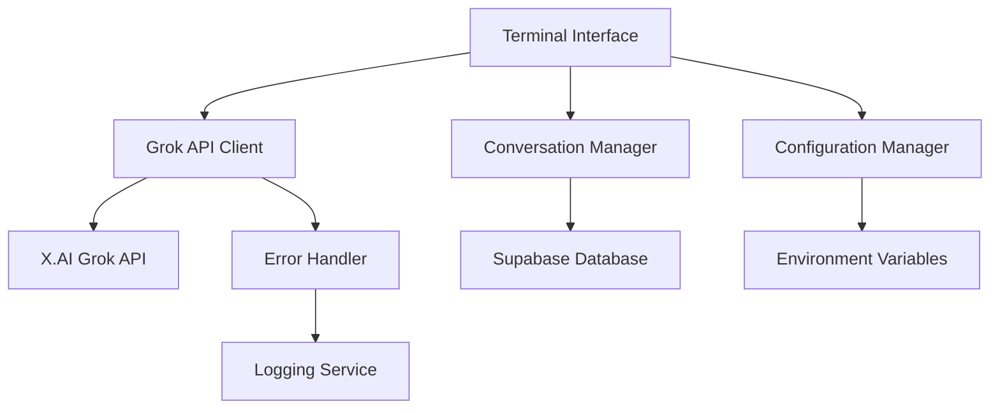

# Design Document

## Overview

This document outlines the design for integrating Grok AI (X.AI) into our AI Dungeon Master terminal interface. The system will provide a production-ready terminal interface that connects to the real Grok API, enabling intelligent D&D assistance with conversation persistence and comprehensive error handling.

## Architecture

### High-Level Architecture



### System Components

1. **Terminal Interface**: Interactive command-line interface for user interaction
2. **Grok API Client**: Handles authentication and communication with X.AI API
3. **Conversation Manager**: Manages conversation history and context
4. **Error Handler**: Comprehensive error handling with retry logic
5. **Configuration Manager**: Manages API keys and system configuration
6. **Logging Service**: Structured logging for debugging and monitoring

## Components and Interfaces

### 1. Terminal Interface (`TerminalInterface`)

**Purpose**: Provides the main user interaction layer

**Key Methods**:
- `start()`: Initialize and start the terminal session
- `displayWelcome()`: Show welcome message and instructions
- `promptUser()`: Display prompt and capture user input
- `displayResponse(response)`: Format and display AI responses
- `handleExit()`: Gracefully close the terminal

**Dependencies**: 
- `GrokAPIClient` for AI communication
- `ConversationManager` for history management

### 2. Grok API Client (`GrokAPIClient`)

**Purpose**: Handles all communication with the X.AI Grok API

**Key Methods**:
- `authenticate()`: Validate API key and establish connection
- `sendMessage(message, context)`: Send message to Grok with conversation context
- `getAvailableModels()`: Retrieve list of available Grok models
- `handleRateLimit()`: Implement exponential backoff for rate limiting

**Configuration**:
- Base URL: `https://api.x.ai/v1`
- Default Model: `grok-beta`
- Authentication: Bearer token in headers
- Timeout: 30 seconds
- Max retries: 3 with exponential backoff

### 3. Conversation Manager (`ConversationManager`)

**Purpose**: Manages conversation history and context

**Key Methods**:
- `initializeSession()`: Start new conversation session
- `addMessage(role, content)`: Add message to conversation history
- `getContext(maxTokens)`: Get relevant conversation context
- `saveToDatabase()`: Persist conversation to Supabase
- `loadFromDatabase(sessionId)`: Load previous conversation

**Data Structure**:
```typescript
interface ConversationMessage {
  id: string;
  role: 'user' | 'assistant' | 'system';
  content: string;
  timestamp: Date;
  tokens?: number;
}

interface ConversationSession {
  id: string;
  userId?: string;
  messages: ConversationMessage[];
  createdAt: Date;
  updatedAt: Date;
}
```

### 4. Error Handler (`ErrorHandler`)

**Purpose**: Comprehensive error handling and recovery

**Key Methods**:
- `handleAPIError(error)`: Process API-specific errors
- `handleNetworkError(error)`: Handle network connectivity issues
- `handleAuthError(error)`: Process authentication failures
- `retryWithBackoff(operation, maxRetries)`: Implement retry logic

**Error Types**:
- Authentication errors (401)
- Rate limiting (429)
- Server errors (5xx)
- Network timeouts
- Invalid API responses

## Data Models

### 1. Grok API Request/Response Models

```typescript
interface GrokCompletionRequest {
  model: string;
  messages: Array<{
    role: 'system' | 'user' | 'assistant';
    content: string;
  }>;
  temperature?: number;
  max_tokens?: number;
  top_p?: number;
}

interface GrokCompletionResponse {
  id: string;
  object: string;
  created: number;
  model: string;
  choices: Array<{
    index: number;
    message: {
      role: string;
      content: string;
    };
    finish_reason: string;
  }>;
  usage: {
    prompt_tokens: number;
    completion_tokens: number;
    total_tokens: number;
  };
}
```

### 2. Database Schema (Supabase)

```sql
-- Conversation sessions table
CREATE TABLE conversation_sessions (
  id UUID PRIMARY KEY DEFAULT gen_random_uuid(),
  user_id UUID REFERENCES auth.users(id),
  title TEXT,
  created_at TIMESTAMP WITH TIME ZONE DEFAULT NOW(),
  updated_at TIMESTAMP WITH TIME ZONE DEFAULT NOW()
);

-- Conversation messages table
CREATE TABLE conversation_messages (
  id UUID PRIMARY KEY DEFAULT gen_random_uuid(),
  session_id UUID REFERENCES conversation_sessions(id) ON DELETE CASCADE,
  role TEXT NOT NULL CHECK (role IN ('user', 'assistant', 'system')),
  content TEXT NOT NULL,
  tokens INTEGER,
  created_at TIMESTAMP WITH TIME ZONE DEFAULT NOW()
);

-- API usage tracking
CREATE TABLE api_usage (
  id UUID PRIMARY KEY DEFAULT gen_random_uuid(),
  session_id UUID REFERENCES conversation_sessions(id),
  model TEXT NOT NULL,
  prompt_tokens INTEGER NOT NULL,
  completion_tokens INTEGER NOT NULL,
  total_tokens INTEGER NOT NULL,
  cost_estimate DECIMAL(10,6),
  created_at TIMESTAMP WITH TIME ZONE DEFAULT NOW()
);
```

## Error Handling

### Error Handling Strategy

1. **Graceful Degradation**: System continues operation even when non-critical components fail
2. **User-Friendly Messages**: Technical errors are translated to understandable messages
3. **Automatic Retry**: Transient errors are automatically retried with exponential backoff
4. **Comprehensive Logging**: All errors are logged with context for debugging

### Error Scenarios and Responses

| Error Type | User Message | System Action |
|------------|--------------|---------------|
| Invalid API Key | "Please check your Grok API key configuration" | Display setup instructions |
| Rate Limit Exceeded | "API rate limit reached. Retrying in X seconds..." | Exponential backoff retry |
| Network Timeout | "Connection timeout. Please check your internet connection" | Retry with longer timeout |
| Server Error | "Grok API is temporarily unavailable. Retrying..." | Automatic retry with backoff |
| Invalid Response | "Received unexpected response from AI. Please try again" | Log error and prompt retry |

### Retry Logic Implementation

```typescript
async function retryWithExponentialBackoff<T>(
  operation: () => Promise<T>,
  maxRetries: number = 3,
  baseDelay: number = 1000
): Promise<T> {
  for (let attempt = 1; attempt <= maxRetries; attempt++) {
    try {
      return await operation();
    } catch (error) {
      if (attempt === maxRetries) throw error;
      
      const delay = baseDelay * Math.pow(2, attempt - 1);
      await new Promise(resolve => setTimeout(resolve, delay));
    }
  }
  throw new Error('Max retries exceeded');
}
```

## Testing Strategy

### 1. Unit Testing

**Components to Test**:
- `GrokAPIClient`: API communication, authentication, error handling
- `ConversationManager`: Message storage, context management
- `ErrorHandler`: Error processing and retry logic
- `TerminalInterface`: User input/output handling

**Testing Framework**: Jest with TypeScript support

**Mock Strategy**: Mock external dependencies (API calls, database operations)

### 2. Integration Testing

**Test Scenarios**:
- End-to-end conversation flow
- Database persistence and retrieval
- API error handling and recovery
- Configuration loading and validation

**Tools**: Jest with Supabase test client

### 3. End-to-End Testing

**Test Scenarios**:
- Complete user workflow from terminal startup to conversation
- Error recovery scenarios
- Performance under load
- API rate limiting behavior

**Tools**: Playwright for automated terminal interaction testing

### 4. Performance Testing

**Metrics to Monitor**:
- API response times
- Memory usage during long conversations
- Database query performance
- Error recovery time

**Tools**: Custom performance monitoring with metrics collection

## Security Considerations

### 1. API Key Management

- Store API keys in environment variables only
- Never log or expose API keys in error messages
- Validate API key format before making requests
- Support key rotation without system restart

### 2. Data Protection

- Encrypt conversation data at rest in Supabase
- Use HTTPS for all API communications
- Implement proper input sanitization
- Follow GDPR guidelines for conversation data

### 3. Rate Limiting Protection

- Implement client-side rate limiting
- Monitor API usage to prevent quota exhaustion
- Graceful handling of rate limit responses
- User notification of usage limits

## Configuration Management

### Environment Variables

```bash
# Required
GROK_API_KEY=your_grok_api_key_here
SUPABASE_URL=your_supabase_url
SUPABASE_ANON_KEY=your_supabase_anon_key

# Optional
GROK_MODEL=grok-beta
GROK_TEMPERATURE=0.7
GROK_MAX_TOKENS=1000
LOG_LEVEL=info
CONVERSATION_CONTEXT_LIMIT=4000
```

### Configuration Validation

- Validate all required environment variables on startup
- Provide clear error messages for missing configuration
- Support configuration file as alternative to environment variables
- Validate API connectivity during initialization

## Deployment Considerations

### 1. Development Environment

- Local development with environment file
- Mock API responses for testing without API costs
- Hot reload for rapid development
- Comprehensive logging for debugging

### 2. Production Environment

- Secure environment variable management
- Production-grade logging and monitoring
- Health checks and status endpoints
- Graceful shutdown handling

### 3. Monitoring and Observability

- API usage metrics and cost tracking
- Error rate monitoring and alerting
- Performance metrics collection
- User session analytics

This design provides a robust, production-ready foundation for integrating Grok AI into our AI Dungeon Master system while maintaining security, reliability, and user experience standards.