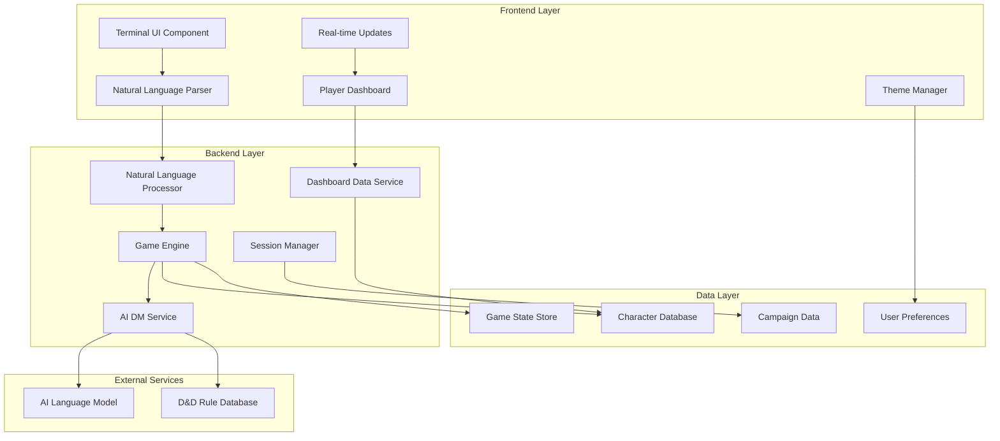

# Design Document

## Overview

The Terminal D&D Interface is a web-based retro terminal emulator designed specifically for text-based Dungeons and Dragons gameplay with AI integration. The system combines the nostalgic aesthetics of classic command-line interfaces with modern web technologies to create an immersive RPG experience. The core interaction model uses natural language processing for all player actions, while a separate dashboard displays character stats, inventory, and game data. This approach eliminates the need for complex command syntax and creates a more intuitive, conversational gameplay experience.

## Architecture

### High-Level Architecture



### System Components

#### Frontend Architecture
- **React-based Terminal Emulator**: Custom terminal component with authentic retro styling (green text on black background by default) for natural language input with cursor blinking animation and scrollable command history
- **Player Dashboard**: Separate panel displaying character stats, inventory, spells, and game data in real-time with resizable and repositionable layout options
- **Natural Language Interface**: Conversational input processing without command syntax requirements, supporting keyboard shortcuts (Ctrl+L for clear, arrow keys for history navigation)
- **Theme System**: Configurable color schemes (classic green, amber, white on black) and visual customization for both terminal and dashboard, with accessibility support including high contrast modes
- **Admin Interface**: Separate administrative panel for campaign management, game configuration, and system monitoring
- **Responsive Design**: Split-screen layout with terminal and dashboard, adaptive for various screen sizes with proper text formatting preservation

#### Backend Architecture
- **Node.js/Express Server**: RESTful API with WebSocket support for real-time dashboard updates
- **Natural Language Processing**: AI-powered interpretation of player actions and intent
- **AI Integration Layer**: Interface to language models for dynamic storytelling and action resolution
- **Game Logic Engine**: D&D rule enforcement and game state management with real-time dashboard sync
- **Authentication System**: User management and session persistence
- **Admin Management System**: Campaign configuration, user monitoring, and system administration tools

#### Database Design
- **PostgreSQL/Supabase**: Primary database for structured data with automatic backups and point-in-time recovery
- **Redis Cache**: Session state and frequently accessed game data with persistence enabled
- **File Storage**: Campaign assets, character portraits, and custom content
- **Session Persistence**: Automatic save-on-change with offline recovery capabilities
- **Data Synchronization**: Real-time sync between client and server with conflict resolution

## Components and Interfaces

### User Interface Components

#### TerminalEmulator
```typescript
interface TerminalEmulator {
  // Core terminal functionality
  displayOutput(text: string, type: OutputType): void;
  processNaturalLanguageInput(input: string): Promise<GameResponse>;
  clearScreen(): void;
  scrollToBottom(): void;
  
  // Visual customization
  setTheme(theme: TerminalTheme): void;
  setFontSize(size: number): void;
  
  // Input history
  addToHistory(input: string): void;
  navigateHistory(direction: 'up' | 'down'): string;
}

interface TerminalTheme {
  backgroundColor: string;
  textColor: string;
  cursorColor: string;
  fontFamily: string;
  fontSize: number;
}
```

#### PlayerDashboard
```typescript
interface PlayerDashboard {
  // Character display
  displayCharacterStats(character: Character): void;
  displayInventory(items: Item[]): void;
  displaySpells(spells: Spell[]): void;
  displayConditions(effects: Effect[]): void;
  
  // Real-time updates
  updateHitPoints(current: number, max: number): void;
  updateSpellSlots(slots: Record<number, SlotInfo>): void;
  updateInventory(changes: InventoryChange[]): void;
  
  // Visual customization
  setLayout(layout: DashboardLayout): void;
  toggleSection(section: DashboardSection): void;
}

interface DashboardLayout {
  sections: DashboardSection[];
  position: 'left' | 'right' | 'bottom';
  width: number;
  collapsible: boolean;
}
```

#### AdminInterface
```typescript
interface AdminInterface {
  // Campaign management
  createCampaign(campaign: CampaignConfig): Promise<Campaign>;
  updateCampaignSettings(campaignId: string, settings: CampaignSettings): Promise<void>;
  managePlayers(campaignId: string, players: PlayerManagement[]): Promise<void>;
  
  // Game configuration
  configureHouseRules(campaignId: string, rules: HouseRule[]): Promise<void>;
  manageCustomContent(content: CustomContent): Promise<void>;
  setGameMechanics(mechanics: GameMechanicsConfig): Promise<void>;
  
  // Monitoring and analytics
  getActiveSessionStats(): Promise<SessionStats[]>;
  getPlayerStatistics(playerId?: string): Promise<PlayerStats>;
  getSystemHealth(): Promise<SystemHealthReport>;
  
  // Content management
  addCustomMonster(monster: CustomMonster): Promise<void>;
  addCustomItem(item: CustomItem): Promise<void>;
  addCustomLocation(location: CustomLocation): Promise<void>;
}

interface CampaignSettings {
  allowedRaces: string[];
  allowedClasses: string[];
  startingLevel: number;
  houseRules: HouseRule[];
  difficultyModifier: number;
  enabledFeatures: string[];
}

interface SystemHealthReport {
  uptime: number;
  activeUsers: number;
  activeSessions: number;
  databaseStatus: 'healthy' | 'degraded' | 'error';
  aiServiceStatus: 'healthy' | 'degraded' | 'error';
  errorLogs: ErrorLog[];
}
```

#### NaturalLanguageProcessor
```typescript
interface NaturalLanguageProcessor {
  interpretPlayerAction(input: string, context: GameContext): Promise<PlayerIntent>;
  extractGameEntities(input: string): GameEntity[];
  validateActionFeasibility(intent: PlayerIntent, gameState: GameState): ValidationResult;
}

interface PlayerIntent {
  action: GameAction;
  target?: string;
  method?: string;
  context: string;
  confidence: number;
}
```

### Game Engine Components

#### GameSession
```typescript
interface GameSession {
  sessionId: string;
  playerId: string;
  characterId: string;
  currentLocation: Location;
  gameState: GameState;
  
  // Core game actions
  executeAction(action: GameAction): Promise<ActionResult>;
  updateGameState(changes: Partial<GameState>): void;
  saveSession(): Promise<void>;
  loadSession(sessionId: string): Promise<void>;
}

interface GameState {
  currentHp: number;
  spellSlots: Record<number, number>;
  inventory: Item[];
  activeEffects: Effect[];
  location: string;
  questLog: Quest[];
}
```

#### AIDungeonMaster
```typescript
interface AIDungeonMaster {
  processPlayerAction(intent: PlayerIntent, context: GameContext): Promise<DMResponse>;
  generateNarrative(context: GameContext): Promise<string>;
  createEncounter(difficulty: number, environment: string): Encounter;
  generateNPC(context: string): NPC;
  handleConversation(playerInput: string, npcContext: NPCContext): Promise<NPCResponse>;
  
  // Enhanced narrative capabilities
  adaptStoryDynamically(playerChoices: PlayerChoice[], context: GameContext): Promise<StoryAdaptation>;
  generateAtmosphericDescription(location: Location, context: GameContext): Promise<string>;
  formatNPCDialogue(speech: string, npcId: string): FormattedDialogue;
  handleUnclearInput(input: string, context: GameContext): Promise<ClarificationRequest>;
}

interface DMResponse {
  narrative: string;
  gameEffects: GameEffect[];
  dashboardUpdates: DashboardUpdate[];
  environmentUpdate?: EnvironmentChange;
  requiresPlayerChoice?: PlayerChoice[];
}

interface DashboardUpdate {
  type: 'hitPoints' | 'spellSlots' | 'inventory' | 'conditions' | 'location';
  data: any;
  animation?: 'highlight' | 'flash' | 'fade';
}
```

### Data Models

#### Character Model
```typescript
interface Character {
  id: string;
  userId: string;
  name: string;
  race: string;
  class: string;
  level: number;
  
  // Core stats
  abilities: {
    strength: number;
    dexterity: number;
    constitution: number;
    intelligence: number;
    wisdom: number;
    charisma: number;
  };
  
  // Game mechanics
  hitPoints: {
    current: number;
    maximum: number;
    temporary: number;
  };
  
  spellSlots: Record<number, { current: number; maximum: number }>;
  inventory: Item[];
  equipment: Equipment;
  
  // Metadata
  createdAt: Date;
  updatedAt: Date;
}
```

#### Campaign Model
```typescript
interface Campaign {
  id: string;
  dmId: string;
  name: string;
  description: string;
  setting: string;
  
  // Game world
  locations: Location[];
  npcs: NPC[];
  quests: Quest[];
  
  // Session management
  sessions: Session[];
  activeSession?: string;
  
  // Configuration
  houseRules: Rule[];
  allowedRaces: string[];
  allowedClasses: string[];
  
  createdAt: Date;
  updatedAt: Date;
}
```

## Error Handling

### Error Categories

#### User Input Errors
- **Invalid Commands**: Provide helpful suggestions and command list
- **Syntax Errors**: Clear error messages with correct syntax examples
- **Permission Errors**: Explain why action cannot be performed

#### Game Logic Errors
- **Rule Violations**: Explain D&D rule constraints
- **State Conflicts**: Handle impossible game states gracefully
- **Resource Limitations**: Clear feedback on spell slots, HP, etc.

#### System Errors
- **Network Issues**: Offline mode with limited functionality
- **Database Errors**: Graceful degradation with local storage fallback
- **AI Service Errors**: Fallback to pre-generated content

### Error Handling Strategy

```typescript
interface ErrorHandler {
  handleUserError(error: UserError): UserFeedback;
  handleGameError(error: GameError): GameResponse;
  handleSystemError(error: SystemError): SystemResponse;
  
  // Recovery mechanisms
  attemptRecovery(error: Error): Promise<boolean>;
  fallbackToOfflineMode(): void;
  restoreFromBackup(backupId: string): Promise<void>;
}

interface UserFeedback {
  message: string;
  suggestions: string[];
  helpCommand?: string;
  severity: 'info' | 'warning' | 'error';
}
```

## Testing Strategy

### Unit Testing
- **Component Testing**: Individual React components with Jest and React Testing Library
- **Service Testing**: Game logic, AI integration, and data services
- **Utility Testing**: Command parsing, validation, and helper functions

### Integration Testing
- **API Testing**: Backend endpoints with supertest
- **Database Testing**: Data persistence and retrieval operations
- **AI Integration Testing**: Mock AI responses for consistent testing

### End-to-End Testing
- **User Journey Testing**: Complete gameplay scenarios with Playwright
- **Terminal Interaction Testing**: Command input, output formatting, and navigation
- **Multi-Session Testing**: Session persistence and restoration

### Performance Testing
- **Load Testing**: Multiple concurrent users and sessions
- **Memory Testing**: Long-running sessions and memory leaks
- **Response Time Testing**: AI response times and user experience

### Testing Implementation

```typescript
// Example test structure
describe('Terminal D&D Interface', () => {
  describe('Natural Language Processing', () => {
    test('should interpret player actions correctly', async () => {
      const nlp = new NaturalLanguageProcessor();
      const intent = await nlp.interpretPlayerAction('I want to attack the goblin with my sword', mockContext);
      expect(intent.action).toBe('attack');
      expect(intent.target).toBe('goblin');
      expect(intent.method).toBe('sword');
      expect(intent.confidence).toBeGreaterThan(0.8);
    });
    
    test('should handle ambiguous input', async () => {
      const nlp = new NaturalLanguageProcessor();
      const intent = await nlp.interpretPlayerAction('use the thing', mockContext);
      expect(intent.confidence).toBeLessThan(0.5);
    });
  });
  
  describe('Dashboard Updates', () => {
    test('should update character stats in real-time', async () => {
      const dashboard = new PlayerDashboard();
      const session = new GameSession();
      
      await session.updateCharacter({ hitPoints: { current: 15 } });
      expect(dashboard.getCurrentHP()).toBe(15);
    });
    
    test('should animate dashboard changes', async () => {
      const dashboard = new PlayerDashboard();
      const update: DashboardUpdate = {
        type: 'hitPoints',
        data: { current: 10, max: 20 },
        animation: 'flash'
      };
      
      await dashboard.applyUpdate(update);
      expect(dashboard.hasActiveAnimation()).toBe(true);
    });
  });
  
  describe('AI Integration', () => {
    test('should generate contextual responses', async () => {
      const dm = new AIDungeonMaster();
      const intent: PlayerIntent = {
        action: 'explore',
        context: 'dark forest',
        confidence: 0.9
      };
      
      const response = await dm.processPlayerAction(intent, mockContext);
      expect(response.narrative).toContain('forest');
      expect(response.dashboardUpdates).toBeDefined();
    });
  });
});
```

### Accessibility Testing
- **Screen Reader Compatibility**: ARIA labels and semantic HTML
- **Keyboard Navigation**: Full functionality without mouse
- **High Contrast Mode**: Visual accessibility compliance
- **Font Scaling**: Responsive text sizing

### Security Testing
- **Input Validation**: SQL injection and XSS prevention
- **Authentication Testing**: Session management and user verification
- **Data Privacy**: Ensure user data protection and GDPR compliance

This design provides a comprehensive foundation for implementing the Terminal D&D Interface while maintaining scalability, maintainability, and user experience quality. The modular architecture allows for incremental development and easy integration of additional features as the system evolves.